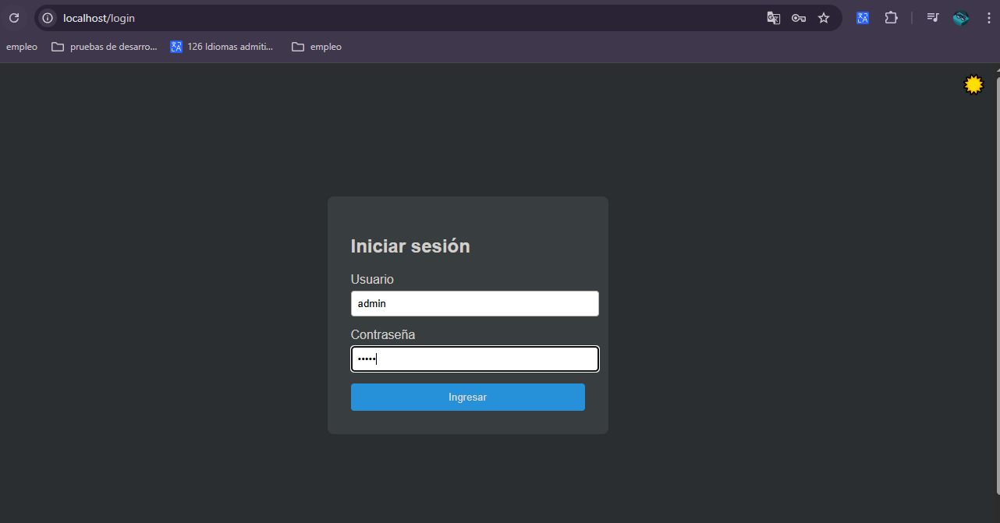
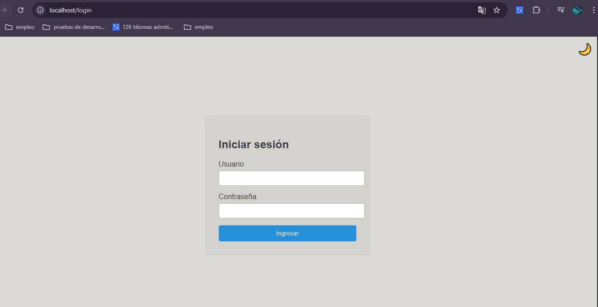
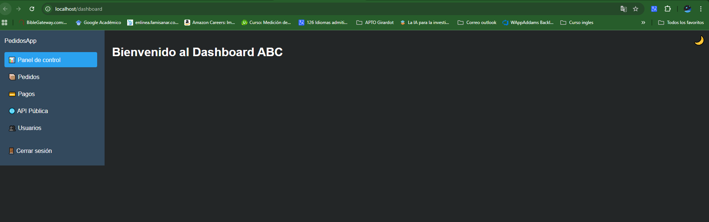
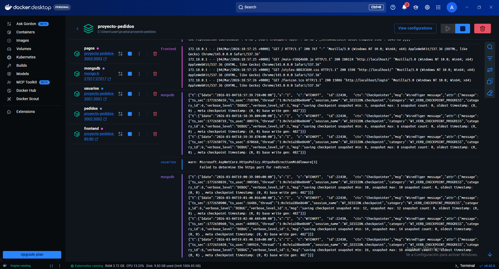
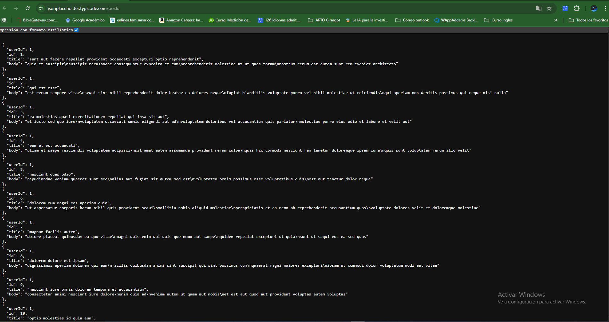
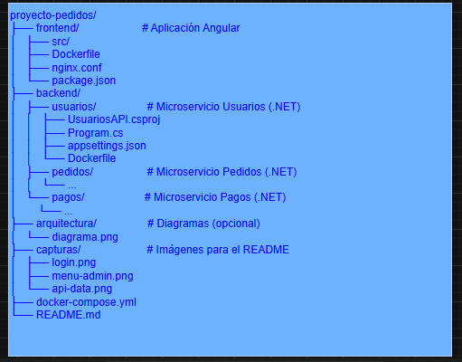

# Toyota Pedidos — Portafolio Comercial

## Sistema Enterprise de Microservicios

---

## Ver el sistema en vivo AHORA

### [INGRESAR AL SISTEMA](https://gentle-water-0ba98b90f.1.azurestaticapps.net)

| Usuario demo | Contraseña | Acceso |
|-------------|-----------|--------|
| admin@toyota.com | Admin123! | Administrador completo |
| vendedor@toyota.com | Vend123! | Módulo de pedidos |
| user@user.com | User@123 | Solo lectura |

---

## Documentos del Proyecto

| Documento | Descripción | Ver |
|-----------|-------------|-----|
| Arquitectura Técnica | Diagrama completo del sistema + Draw.io XML | [Ver](ARQUITECTURA_TECNICA.md) |
| Plan PMO | Cronograma, fases y presupuesto de implementación | [Ver](PMO_PLAN_PROYECTO.md) |
| Manual de Usuario | Guía paso a paso para usuarios finales | [Ver](MANUAL_USUARIO.md) |
| Manual Técnico | 18 pruebas API documentadas con Postman | [Ver](MANUAL_TECNICO_PRUEBAS.md) |

---

## Capturas de Pantalla

| Pantalla | Vista |
|---------|-------|
| Login modo oscuro |  |
| Login modo claro |  |
| Menú administrador |  |
| Contenedores Docker |  |
| API pública |  |
| Arquitectura completa |  |

---

## Lo que hace este sistema

- Gestión de pedidos en tiempo real desde cualquier dispositivo
- Control de pagos con roles estrictos (solo Admin)
- 3 niveles de acceso: Administrador, Vendedor, Usuario
- Funciona en PC y celular sin instalar nada (PWA)
- 100% en la nube — no necesita servidor propio
- Seguridad JWT con tokens de acceso firmados
- Base de datos PostgreSQL + MongoDB en Azure
- CI/CD automatizado: push a GitHub → deploy en Azure en minutos

---

## Stack Tecnológico

| Capa | Tecnología |
|------|-----------|
| Frontend | Angular 21 · TypeScript · Signals API |
| Backend | .NET 8 · ASP.NET Core · JWT Bearer |
| Gateway | YARP Reverse Proxy |
| Base de datos | PostgreSQL 15 · MongoDB |
| Nube | Azure Container Apps · Azure Static Web Apps |
| DevOps | Docker · GitHub Actions · Azure Container Registry |

---

## Inversión

### $20.000.000 COP — Todo incluido

- Sistema completo funcionando en Azure
- Código fuente 100% propiedad del cliente
- 4 semanas de implementación documentadas
- Capacitación de 2 horas (grabada en video)
- 15 días de soporte post-entrega
- Manuales de usuario y técnico incluidos
- Sin costos ocultos ni mensualidades

**Forma de pago:** 50% al firmar · 50% a la entrega

---

## Arquitectura del Sistema

```
Navegador / Móvil (PWA)
        │ HTTPS
        ▼
Azure Static Web Apps — Angular 21
        │ REST + JWT Bearer
        ▼
Azure Container Apps — YARP Gateway :5000
   ├── /api/usuarios/** → Usuarios Service :3001  → PostgreSQL usuarios_db
   ├── /api/pedidos/**  → Pedidos Service  :3002  → PostgreSQL pedidos_db + MongoDB
   └── /api/pagos/**    → Pagos Service    :3003  → PostgreSQL pagos_db

GitHub push → GitHub Actions → Docker build → ACR → Container Apps deploy
```

---

## Contacto

**Alejandro Chaparro Reyes**
Desarrollador FullStack Senior — Bogotá, Colombia

- Email: alejandrochreyes2@gmail.com
- GitHub: https://github.com/alejandrochreyes2

Respuesta garantizada en menos de 24 horas.
Primera consulta sin costo.
